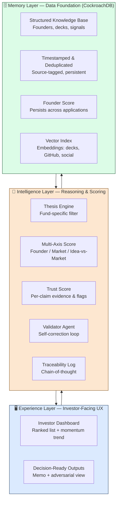
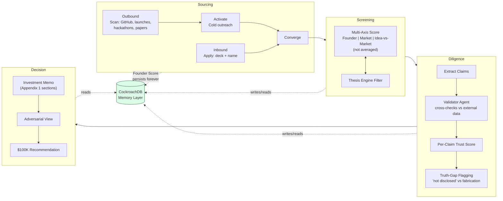
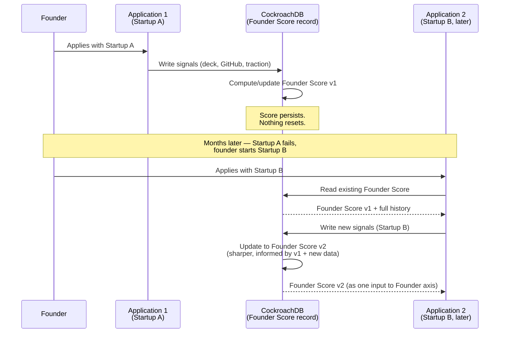
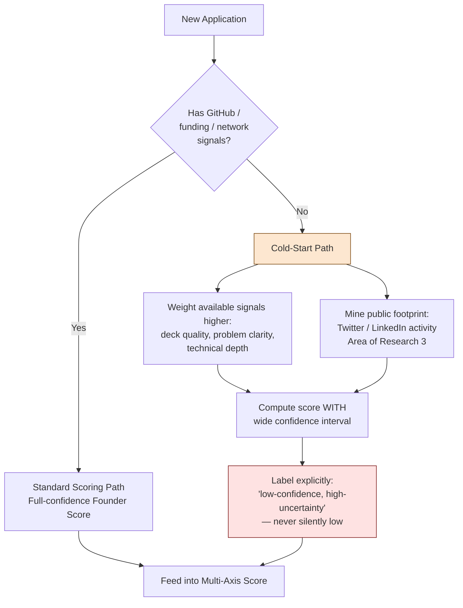
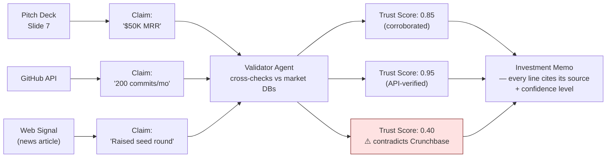
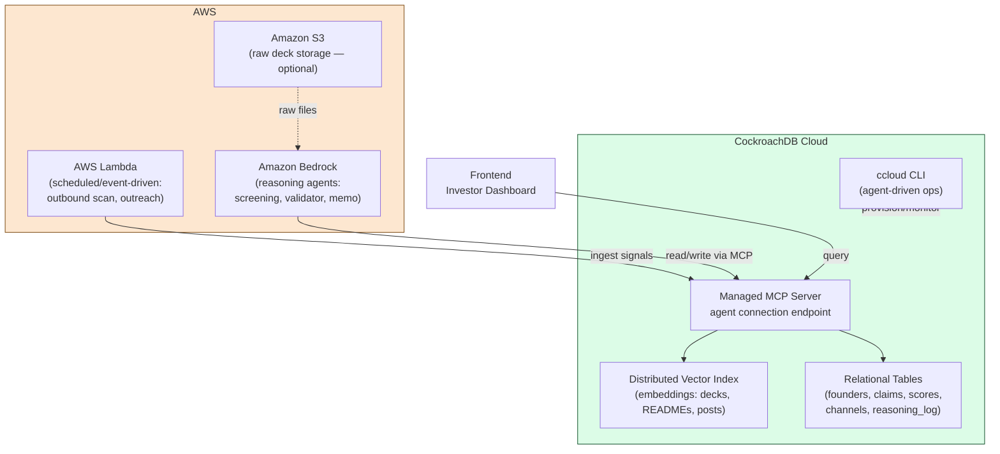
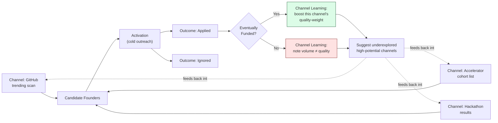

# FEATURES.md — VC Brain: Complete Feature Specification

**Scope note:** Every feature listed in the original Hack-Nation problem statement — including all "Stretch Goals" and "Areas of Research" — is treated as **mandatory** for this build. Nothing here is optional. Each feature is mapped to its implementation using **CockroachDB** (persistent memory layer, ≥2 tools) and **AWS** (≥1 service), per the CockroachDB × AWS Hackathon requirements.

Every feature below follows the same structure:
- **What it is**
- **How we're building it** (technical mechanism)
- **Why we're building it** (the problem it solves, tied back to the PS)
- **Its purpose in the complete app** (how it connects to the rest of the system)

---

## PART A — THE THREE PILLARS (Core Architecture)

The whole system is organized into three layers that every other feature plugs into. Understanding these first makes every subsequent feature's "purpose" clear.

### A1. Memory Layer (Data Foundation)

**What it is:** The persistent, append-only store of every piece of data ever collected about a founder, company, or signal — decks, GitHub activity, social traction, interviews, launches — nothing is ever discarded.

**How we're building it:**
- **CockroachDB** as the system of record. Structured relational tables for founders, companies, applications, signals, claims, and scores.
- **CockroachDB Distributed Vector Indexing** for embeddings of unstructured content (deck text, GitHub READMEs, social posts, interview transcripts) — enabling semantic retrieval without a separate vector store.
- Every row is timestamped, source-tagged, and versioned (never overwritten — new signals are appended, old ones are superseded but retained for trend analysis).
- Deduplication logic runs on ingestion: fuzzy-matching founder name + email + GitHub handle + company domain to merge signals about the same person/entity instead of creating duplicate records.

**Why we're building it:** The PS explicitly states "Memory — the data foundation. Nothing discarded" and lists deduplication, enrichment, timestamping, and source-tagging as required behaviors. A system that forgets or overwrites data cannot produce a Founder Score that "gets sharper with every milestone" — the entire credit-score analogy depends on historical persistence.

**Purpose in the complete app:** Every other layer (Intelligence, Experience) reads from and writes back to Memory. It is the substrate the Founder Score, Trust Score, and Multi-Axis Scores all live in. It is also literally the hackathon's core requirement: "an agentic application that uses CockroachDB as its persistent memory layer."

---

### A2. Intelligence Layer (Reasoning & Scoring)

**What it is:** The layer that turns raw Memory into decision-ready insight — the Thesis Engine, Multi-Axis Score, Trust Score, and Founder Score all live here.

**How we're building it:** Agents (built with an agent framework, orchestrated via AWS Bedrock/Lambda) that read structured + vector data from CockroachDB, reason over it, write derived scores/claims back into CockroachDB, and expose their reasoning trace for auditability.

**Why we're building it:** The PS requires the system to "produce insights, challenge assumptions, and recommend next steps" and be "transparent about confidence, uncertainty, and the evidence behind every conclusion" — this can't happen with raw data alone; it needs a reasoning layer with explicit outputs.

**Purpose in the complete app:** This is the layer that makes the system an "investment partner" rather than a database. It converts Memory into the Multi-Axis Score, Trust Score, and eventually the Investment Memo.

---

### A3. Experience Layer (Investor-Facing UX)

**What it is:** The dashboard and memo/output surface a non-technical investor actually uses.

**How we're building it:** A web frontend (framework TBD by implementation team) reading from CockroachDB via API/backend, rendering ranked founder lists, momentum trends, and decision-ready memo outputs.

**Why we're building it:** PS requirement #8, "Investor-Grade UX... Notion-level approachability, Bloomberg-level analytical depth," is explicit and non-negotiable regardless of how strong the backend is.

**Purpose in the complete app:** This is where the whole pipeline (Sourcing → Screening → Diligence → Decision) becomes usable by a human investor within the 24-hour window — the actual deliverable a judge/user interacts with.

---

## PART B — SOURCING (Inbound + Outbound)

### B1. Inbound Application Intake

**What it is:** A minimal-friction application form: deck + company name is the *only* mandatory input.

**How we're building it:** A simple form/API endpoint that accepts a pitch deck file + company name, immediately creates a founder/company record in CockroachDB, and triggers the Screening pipeline. Any additional fields (founder LinkedIn, GitHub, etc.) are optional and only requested if the Screening step flags insufficient confidence.

**Why we're building it:** The PS is explicit: "deck + company name is the minimum bar; any further fields are the minimum needed for a confident 24-hour decision" and warns "over-collecting works against you." This is a direct, testable requirement (FAQ Q4).

**Purpose in the complete app:** This is the "front door" for founders who apply directly rather than being discovered — it must converge into the same Screening funnel as Outbound sourcing (see B3), so the system treats both entry paths identically.

---

### B2. Outbound Founder Identification (Continuous Signal Scanning)

**What it is:** Proactive, continuous scanning of external sources to surface founders *before* they start fundraising — explicitly called "the most important part of your MVP" and "the area with the least commercial competition."

**How we're building it:**
- Scheduled/event-driven scraping and ingestion agents (running on **AWS Lambda**, invoked on a schedule or triggered by webhook) pulling from: GitHub (commit activity, trending repos, new repo creation by pattern-matched profiles), ProductHunt/launch platforms, Hacker News (Show HN posts), arXiv/patents (technical papers with product-shaped abstracts), and public hackathon result pages/accelerator cohort lists.
- Every discovered signal is written into CockroachDB as a "candidate" record and scored through the *exact same* Screening pipeline as inbound applications (B4) — same schema, same scoring axes, so there is no separate "second-class" data path.
- Deduplication against existing Memory records happens immediately (a GitHub user later applying inbound must resolve to the same founder record).

**Why we're building it:** PS Section 2 states Sourcing is "the most important part of your MVP" and explicitly instructs: "go further here than anywhere else." The Evaluation Criteria confirms Data Architecture (which subsumes Sourcing) carries the largest single weight of any category. This is the highest-leverage feature in the entire build.

**Purpose in the complete app:** This is what makes the system genuinely "find the next Cursor before anyone else" rather than a passive form-processor. It feeds the Founder Score with early, pre-application signal — solving the cold-start problem partially before a founder even applies.

---

### B3. Activation (Cold Outreach Trigger)

**What it is:** When Outbound scanning surfaces a strong match, the system reaches out directly to invite a real application — "cold outreach, not cold investment."

**How we're building it:** An agent (Lambda-triggered) that drafts and sends a templated, personalized outreach message (email or social DM) referencing the specific signal that surfaced them (e.g., "we noticed your repo X"), with a direct link to apply. Every outreach attempt and its outcome (opened/applied/ignored) is logged back to CockroachDB against that founder's record — this becomes input to the Sourcing & Network Intelligence feature (F2).

**Why we're building it:** PS Section 5 explicitly separates "Identify" from "Activate" — sourcing data alone isn't enough; the system must close the loop by converting a passive signal into an active applicant, which is the actual business outcome (a funded deal).

**Purpose in the complete app:** Converts Outbound sourcing from a research exercise into a functioning acquisition funnel that feeds real applications into Screening — and its success/failure rate is exactly the training signal the Sourcing & Network Intelligence stretch goal needs.

---

### B4. Convergence (Unified Funnel)

**What it is:** Guarantee that Inbound and Outbound-activated applications flow into one identical Screening pipeline — no separate "tiers" of founders.

**How we're building it:** A single `applications` table/schema in CockroachDB with a `source` column (`inbound` | `outbound_activated`), but every downstream query, score, and memo-generation process is source-agnostic.

**Why we're building it:** PS states explicitly: "activated applications flow into the same Screening step as inbound, so both tracks feed one funnel." This is a direct architectural requirement, not a nice-to-have.

**Purpose in the complete app:** Prevents an architectural anti-pattern where outbound-sourced founders get second-class treatment — ensures the Founder Score and Trust Score mean the same thing regardless of how a founder entered the system.

---

## PART C — SCREENING & SCORING

### C1. Thesis Engine (Fund-Specific Configuration)

**What it is:** A configurable filter where an investor sets sectors, stage, geography, check size, ownership targets, and risk appetite — every recommendation is filtered/scored through this specific lens.

**How we're building it:** A settings table in CockroachDB storing the investor's thesis parameters as structured, editable fields. Every scoring/ranking query joins against this table so results are always filtered through the *current* thesis — changing the thesis re-ranks the entire founder pool without needing to re-ingest data.

**Why we're building it:** PS FAQ Q15 is explicit: "Configurable... A hardcoded thesis misses the point of the pillar." Multiple funds/users must be able to run genuinely different theses over the same underlying Memory.

**Purpose in the complete app:** This is what makes the "reach and analytical power of an entire organisation" personal to *one specific fund's* strategy rather than a generic ranked list — it's the first thing an investor configures and the lens every other feature operates through.

---

### C2. Smart Data Collection & Management (Structuring Heterogeneous Data)

**What it is:** Actively collecting, validating, and structuring founder/company data from wildly different source formats (PDF decks, GitHub API JSON, social post text, launch-page HTML).

**How we're building it:** Format-specific parsers/extractors (deck → text+slide-image extraction; GitHub → API-structured metrics; social → text) normalize everything into a common schema before it hits CockroachDB. Validation rules flag malformed/incomplete extractions as low-confidence rather than silently accepting bad data.

**Why we're building it:** PS: "the data layer matters as much as the intelligence built on top of it." Evaluation Criteria explicitly notes generic ingestion won't score well alone — but *poor* ingestion undermines everything downstream regardless of how good the reasoning layer is.

**Purpose in the complete app:** This is the actual substance behind "Data Architecture and Intelligence" as a category — every score, memo, and Trust Score claim is only as good as this normalization step.

---

### C3. Multi-Attribute (Natural-Language) Reasoning

**What it is:** Support for compound natural-language queries like "technical founder, Berlin, AI infra, enterprise traction, no prior VC backing, top-tier accelerator" resolved in one pass — not five manual filters.

**How we're building it:** An LLM-backed query agent (via **AWS Bedrock**) that parses the natural-language query into a structured multi-condition query, executes it against CockroachDB (combining structured filters + vector similarity search over the embedded signal data), and returns ranked results with per-condition match explanations.

**Why we're building it:** PS explicitly requires moving "beyond keyword search" — FAQ Q12 confirms this must resolve as one compound query, not decomposed manual filtering.

**Purpose in the complete app:** This is the primary interface an investor uses to explore the founder pool — it's what makes the "reach of an entire organisation" usable by one person without needing to know a query language.

---

### C4. Multi-Axis Screening (Three Independent, Non-Averaged Scores)

**What it is:** Every opportunity scored along three *independent* axes — Founder, Market, Idea vs. Market — each with its own trend direction, never averaged into one number.

**How we're building it:** Three separate scoring agents/functions, each writing its own score + trend (`improving`/`declining`/`stable`) + supporting evidence into distinct columns/tables in CockroachDB. UI and memo generation always display all three separately — no aggregation step exists anywhere in the pipeline.

**Why we're building it:** PS Section 6 and FAQ Q5 explicitly forbid averaging: "Collapsing them hides exactly the disagreement an investor needs to see." This is a direct, testable anti-requirement (a wrong implementation would average the scores).

**Purpose in the complete app:** This is the core signal an investor uses to make a nuanced decision — e.g., a strong Founder score with a weak Market score is a fundamentally different bet than the reverse, and averaging would destroy that distinction.

---

### C5. Founder Score (Persistent Cross-Application Credit Score)

**What it is:** A "credit score for founders" — a living profile that persists across *every* application a founder ever makes, gets sharper with every milestone, and never resets.

**How we're building it:** A dedicated `founder_score` record keyed to a deduplicated founder identity (not per-application) in CockroachDB, updated transactionally every time new signal arrives about that person (new repo, new company, new outreach outcome, new application). Historical values are retained (append-only) so score *trend* over time is queryable, not just the latest snapshot.

**Why we're building it:** This is the PS's central narrative device made literal: "your system should actually produce this score, and use it as one input into every investment decision... Ship something once, and your next idea starts from a stronger position." FAQ Q6 explicitly distinguishes this from the per-opportunity 3-axis score.

**Purpose in the complete app:** This is the one feature that makes CockroachDB's "memory that never goes down" pitch *meaningfully* necessary rather than decorative — a global, consistent, always-available score that must never corrupt under concurrent writes from multiple sourcing/screening agents is exactly CockroachDB's design target. It also feeds directly into the Founder axis of C4 as one input, not a replacement.

---

### C6. Cold-Start Handling (Pre-Track-Record Founders)

**What it is:** An explicit method for scoring first-time founders with no GitHub history, no funding, no network — rather than silently scoring them low by default.

**How we're building it:**
- A distinct scoring path that does *not* penalize absence of track-record signals as a negative — instead it weights available signals (deck quality, problem articulation, technical depth of the idea itself, any public footprint at all) more heavily and explicitly labels the Founder Score as "low-confidence, high-uncertainty" rather than "low."
- Confidence intervals (see F1) are especially wide for these cases and are surfaced, not hidden.
- Public footprint mining (Twitter/LinkedIn presence, even without funding/GitHub history) is used as a supplementary signal specifically for this case (ties directly to Area of Research 3).

**Why we're building it:** The PS is unusually explicit and repeated on this point: "generic ingestion / enrichment quality alone will not score highly here if it doesn't address the cold-start, pre-track-record case" (Evaluation Criteria) and FAQ Q10/Q11 dedicate significant space to warning against ignoring it: "otherwise you've just rebuilt the network-gated system the challenge exists to replace."

**Purpose in the complete app:** This is the feature that makes the whole "Equitable Capital Allocation" mission statement (Section 7) actually true rather than aspirational — without it, the system just re-creates the network-gated bias it claims to fix, scoring only founders who already have visible track records.

---

## PART D — DILIGENCE & TRUST

### D1. Evidence-Backed Claims (Per-Claim Trust Score)

**What it is:** Every factual claim (traction, revenue, team background, market size) must trace to specific evidence with its own confidence level — not one aggregate "trust score" for the whole company.

**How we're building it:** A `claims` table in CockroachDB: each row = one extracted claim, a foreign key to the source record it came from (deck slide, GitHub signal, interview line), and a confidence score. Verification agents cross-check claims against external sources where possible (see D2) and update confidence accordingly. Contradictory claims about the same fact are flagged, not silently overwritten.

**Why we're building it:** PS Section 6/FAQ Q7 is explicit: "No — it's per claim... verified externally where possible, with contradictions flagged before they reach the investor." A single whole-company trust number would hide exactly which specific claims are shaky.

**Purpose in the complete app:** This is what makes the Investment Memo (Part E) trustworthy rather than a generated narrative — every sentence in the memo that states a fact can be traced back to this table.

---

### D2. Self-Correction Loop (Validator Agent)

**What it is:** A second agent that independently cross-references the primary agent's extracted claims against external market databases, comparable funding rounds, and observable evidence — explicitly to catch hallucination.

**How we're building it:** A separate Validator Agent (distinct model/prompt from the primary extraction agent) that re-queries claims against external web/data sources, writes its own confidence/agreement score back into the `claims` table (D1) alongside the primary agent's claim, and flags disagreements for human review in the memo output.

**Why we're building it:** Explicitly listed as Stretch Goal #2, treated as mandatory per this project's scope: "cross-references extracted founder claims against market databases, comparable funding rounds, and observable evidence to ensure the primary agent is not hallucinating."

**Purpose in the complete app:** This is the mechanism that actually earns the Trust Score's name — without independent verification, "Trust Score" is just the primary agent's self-reported confidence, which is not trustworthy on its own.

---

### D3. Agentic Traceability (Chain-of-Thought / Source Citation)

**What it is:** Every recommendation cites the *exact* data point (deck slide number, specific web signal URL, specific interview excerpt) that drove the conclusion — with full step-level reasoning logged.

**How we're building it:** Every agent call logs its intermediate reasoning steps (chain-of-thought) to a `reasoning_log` table in CockroachDB, linked to the specific claim/score it produced and the specific source record it read. The Experience layer renders this as an expandable "why" trail behind every score and every memo line.

**Why we're building it:** Explicitly Stretch Goal #1, and the PS's own FAQ Q13 states: "Agentic Traceability... is the highest-leverage add" because "it directly reinforces the core Trust Score requirement." Treated as mandatory in this build.

**Purpose in the complete app:** This is what makes the system's evidence claims *falsifiable* by the investor — a Trust Score without a visible reasoning trail is just an opaque number; this feature is what turns "trust" into something the investor can actually audit in seconds.

---

### D4. Diligence Truth-Gap Check (Explicit Gap-Flagging, No Fabrication)

**What it is:** Where a data point (financials, cap table, customer references) is missing, unavailable, or intentionally withheld, the system must explicitly flag the gap ("Cap table: not disclosed") rather than silently omit it or fabricate a plausible-sounding number.

**How we're building it:** Memo-generation logic checks each required Investment Memo section (Appendix 1) against the Memory layer; any section with no corresponding data writes an explicit `"<section>: not disclosed"` / `"unavailable at this stage"` line instead of skipping the section or hallucinating content.

**Why we're building it:** Appendix 1 instructions and FAQ Q9 are unambiguous: "You are not expected to fabricate this data convincingly... A memo that clearly marks its own gaps is more trustworthy... than one that fills them in invisibly."

**Purpose in the complete app:** This is a hard safety rail against the single most damaging failure mode for an investment tool — confidently fabricated financials. It is enforced at the memo-generation step, downstream of all scoring.

---

## PART E — DECISION & OUTPUT

### E1. Evidence-Backed Investment Memo Generation

**What it is:** The final decision-ready artifact — a structured memo covering Company snapshot, Investment Hypotheses, SWOT, Team & History, Problem & Product, Technology & Defensibility, Market Sizing, Competition, Traction & KPIs, Financials & Round Structure, Cap Table, Due Diligence Log, and Exit Perspective (per Appendix 1), with the five marked sections (Company snapshot, Investment hypotheses, SWOT, Problem & product, Traction & KPIs) always populated and the rest included with explicit gap-flags where data is missing.

**How we're building it:** A memo-generation agent that reads all Memory + Intelligence layer outputs (Founder Score, 3-axis scores, Trust Score per claim, reasoning trail) for a given founder/company and composes the structured memo, obeying the "as detailed as the decision requires, as brief as clarity allows" length rule (no padding).

**Why we're building it:** This is the literal deliverable described in the PS's Appendix 1 and is worth acting on: "Does the tool produce a recommendation a human investor could genuinely act on within 24 hours?"

**Purpose in the complete app:** This is where every other feature (Founder Score, Trust Score, Multi-Axis Score, Traceability, Gap-flagging) converges into one artifact a human actually reads and decides from — the single output that makes the whole pipeline "actionable."

---

### E2. Investment Decision Output ($100K Recommendation + Adversarial/Portfolio Check)

**What it is:** A final recommendation (invest $100K / pass / need more info) alongside an adversarial view (the strongest counter-argument against investing) and a basic portfolio-fit check against the Thesis Engine's parameters.

**How we're building it:** A decision agent that takes the completed memo + all scores, generates an explicit adversarial critique (a "red team" pass arguing against the recommendation), and checks the opportunity against the Thesis Engine's stated ownership/check-size/risk targets before emitting a final recommendation — all written back to CockroachDB as the terminal record of the pipeline.

**Why we're building it:** The architecture diagram in the PS explicitly labels the final pipeline stage as "Investment Decision: $100K rec. + adversarial & portfolio check" — this is a named, required pipeline terminus, not implied.

**Purpose in the complete app:** This is the literal fulfillment of the PS's headline goal — "Deploying $100K Checks in 24 Hours" — the point where the system stops analyzing and produces an actionable investment call.

---

### E3. Investor Dashboard (Ranked List + Momentum Trend)

**What it is:** The primary investor-facing view: a ranked list of founders/opportunities (ranked per the current Thesis Engine config) with a momentum trend indicator per founder (is their Founder Score / axis scores improving, declining, or stable over time).

**How we're building it:** A dashboard UI reading live from CockroachDB, joining current Thesis Engine parameters against the founder pool, sorted by fit + score, with a sparkline/trend indicator per founder pulled from the historical (append-only) score records.

**Why we're building it:** Named explicitly in the architecture diagram as the Experience layer's primary component: "Investor dashboard: Ranked list + momentum trend."

**Purpose in the complete app:** This is the day-to-day working surface an investor actually opens — the entry point into everything else (drilling into a founder opens their memo, traceability trail, and score history).

---

## PART F — STRETCH GOALS / RESEARCH (Treated as Mandatory)

### F1. Confidence Scoring with Prediction Intervals

**What it is:** Rather than a single point-estimate confidence number, soft-skill assessments (resilience, founder-market fit) are expressed as a range/prediction interval reflecting how messy/incomplete the underlying data is.

**How we're building it:** Scoring functions for soft-skill axes output a `(low, mid, high)` interval rather than one number, with interval width inversely proportional to the amount/quality of underlying evidence (few data points → wide interval; rich data → narrow interval). Stored and displayed alongside every soft-skill-derived score.

**Why we're building it:** Listed as Area of Research 1 — explicitly framed as "genuinely open" but "document your approach if you crack one," and directly relevant to the Cold-Start feature (C6): a first-time founder's soft-skill score should visibly carry more uncertainty than a founder with rich history.

**Purpose in the complete app:** Prevents the system from expressing false precision — an investor sees not just "Resilience: 7/10" but "Resilience: 5–9/10 (low confidence, 2 data points)," which is honest about what the system actually knows versus what it's guessing.

---

### F2. Sourcing & Network Intelligence (Channel Learning Graph)

**What it is:** Modeling the sourcing graph — the network of programs, institutions, and individuals through which founders become visible — tracking which channels historically produce the strongest opportunities, proactively suggesting underexplored channels, and feeding funded-deal outcomes back into the model.

**How we're building it:** A graph-shaped schema in CockroachDB (`channels`, `channel_founder_links`, `outcomes` tables) recording every channel a founder was surfaced through (specific GitHub org, specific accelerator cohort, specific hackathon) and every downstream outcome (activated → applied → invested). A periodic scoring job ranks channels by conversion-to-funded-deal rate and surfaces underexplored-but-historically-strong channels back to the Outbound Activation agent (B3) as new scanning targets.

**Why we're building it:** Listed as Stretch Goal #3, and directly closes the loop described in B3's Activation feature — outreach outcomes are otherwise a dead-end data point unless something learns from them.

**Purpose in the complete app:** This is what makes Sourcing (Part B) *improve over time* rather than stay static — the system's most important pillar (per Evaluation weighting) becomes self-optimizing rather than a fixed set of scanners.

---

### F3. Founder Traits & Public-Footprint Prediction (Research Feature)

**What it is:** An explicit, testable approach to the question: how much can public footprints (Twitter, LinkedIn activity, posting patterns, engagement) predict founder success — used specifically to strengthen the Cold-Start case (C6).

**How we're building it:** A feature-extraction pipeline pulling public social signals (post frequency, technical content ratio, engagement growth) into structured features in CockroachDB, paired with a lightweight predictive model (trained/inferred via **Amazon SageMaker** or Bedrock) whose output is treated as one *additional* soft input into the Founder axis for founders who lack GitHub/funding history — never as a standalone score, and always displayed with a wide confidence interval (F1) given how experimental this signal is.

**Why we're building it:** Listed as Area of Research 3, and explicitly flagged by the PS's own FAQ (Q11) as "the most direct lever on the cold-start weakness... Teams that take a real stab at this, even partially, are documenting exactly the kind of approach the brief says could be industry-defining."

**Purpose in the complete app:** This is the second concrete tool (alongside C6's default handling) for solving the cold-start problem — the PS treats this as a research question, so our implementation documents the approach and its limitations rather than overclaiming predictive accuracy.

---

### F4. Data Quality vs. Volume Triage (Research Feature)

**What it is:** An explicit policy/mechanism for deciding what incoming data is worth structuring and storing at full confidence versus flagging as low-confidence noise — since "more data isn't always better."

**How we're building it:** An ingestion-time triage step: every incoming signal gets a provisional quality score based on source reliability (verified GitHub API > scraped social post > unverified third-party mention) and internal consistency (does it corroborate or contradict existing claims). Low-quality signals are stored (nothing discarded, per A1) but tagged `low_confidence` and excluded from primary score calculations unless corroborated later.

**Why we're building it:** Listed as Area of Research 2, and directly operationalizes the Memory layer's "nothing discarded" principle without letting noisy data silently degrade the Founder/Trust Scores.

**Purpose in the complete app:** This is the quality-control layer sitting between raw ingestion (C2) and scoring (C4/C5) — it's what prevents "smart data collection" from becoming "garbage in, garbage out" at scale.

---

## PART G — CockroachDB × AWS HACKATHON COMPLIANCE FEATURES

These aren't from the original PS — they're explicit hackathon submission requirements from cockroachdb-ai.devpost.com, included here because "nothing is optional."

### G1. CockroachDB Cloud Managed MCP Server Integration

**What it is:** Direct connection from our agents to the CockroachDB cluster via the managed MCP Server, rather than a custom database proxy.

**How we're building it:** Configure the single config snippet from the CockroachDB Cloud Console (endpoint `https://cockroachlabs.cloud/mcp`), used by our agent framework (Claude Code/Cursor/LangChain-compatible) to read/write Memory directly, with read-only mode and audit logging enabled where agents only need retrieval (e.g., dashboard queries) and full read-write for ingestion/scoring agents.

**Why we're building it:** Mandatory — submissions must use ≥2 CockroachDB tools, and this is the most central one (it's how *every* agent in Parts A–F actually talks to the database).

**Purpose in the complete app:** This is the literal wiring between the Intelligence layer's agents and the Memory layer's data — without it, nothing above is CockroachDB-backed at all.

### G2. CockroachDB Distributed Vector Indexing

**What it is:** Native vector storage/indexing inside CockroachDB for all embeddings (deck text, README content, social posts) rather than a separate vector database.

**How we're building it:** Embeddings generated (via Bedrock) for every ingested unstructured document, stored in a vector column in CockroachDB, queried via distributed vector index for semantic search (used directly by C3's Multi-Attribute Reasoning and D1's claim-similarity matching).

**Why we're building it:** Mandatory tool #2 (satisfies the "≥2 tools" requirement alongside G1); also structurally necessary for C3 — there's no way to do natural-language multi-attribute search without semantic retrieval.

**Purpose in the complete app:** Keeps vector data and structured operational data consistent in one system (per hackathon's own framing) — a founder's Founder Score and their deck's embedding never drift out of sync because they live in the same transactional store.

### G3. ccloud CLI (Agent-Ready Cluster Management)

**What it is:** Agent-driven provisioning/monitoring of the CockroachDB cluster itself (backups, networking, audit logs) via CLI rather than manual console operations.

**How we're building it:** An operations agent uses the ccloud CLI's JSON output and noun-verb command patterns to provision the cluster at setup, and optionally monitor audit logs as part of the Trust/Diligence layer's own self-audit.

**Why we're building it:** Optional beyond the 2-tool minimum, but strengthens the submission by demonstrating deeper use of the CockroachDB agent toolchain — included here since "nothing is optional or additional" per this project's scope.

**Purpose in the complete app:** Demonstrates the system managing its own infrastructure agentically — relevant to the hackathon's "production-grade, persistent memory" framing, not just using the database passively.

### G4. CockroachDB Agent Skills Repo Usage

**What it is:** Using the open-source, machine-executable Agent Skills (query/schema design, performance, security, observability) as part of our agents' own operating knowledge.

**How we're building it:** Load relevant skills (schema design, query optimization) into our agent framework so ingestion/scoring agents write efficient, correct CockroachDB queries and schema migrations without hand-written boilerplate.

**Why we're building it:** Available as a 4th optional CockroachDB tool; included for completeness per this project's "implement everything" scope.

**Purpose in the complete app:** Improves reliability/correctness of every agent that touches the database (essentially all of Parts A–F), reducing schema/query errors during the 24-hour build-and-demo window.

### G5. AWS Service Integration (Required: ≥1)

**What it is:** At least one AWS service powering the agent's runtime environment.

**How we're building it:**
- **Amazon Bedrock** — foundation model calls for all reasoning agents (Screening, Trust/Validator, Memo generation, Multi-Attribute query parsing).
- **AWS Lambda** — event-driven execution for Outbound scanning (B2), Activation outreach (B3), and scheduled score-refresh jobs.
- (Optional additional) **Amazon S3** — raw file storage for uploaded pitch decks prior to parsing.

**Why we're building it:** Mandatory hackathon requirement — "at least one AWS service that powers your agent's environment."

**Purpose in the complete app:** Bedrock is the actual reasoning engine behind every Intelligence-layer feature (C1–C6, D1–D4, E1–E3); Lambda is the execution substrate for every autonomous/scheduled agent (B2, B3, F2's periodic channel-scoring).

### G6. Submission Package Compliance

**What it is:** All the non-code deliverables required for judging.

**How we're building it:**
- Public open-source repo with MIT/Apache 2.0 license visible in the About section.
- Complete README (setup/run instructions, dependencies, example configs).
- Functional demo app URL.
- ≤3-minute public YouTube/Vimeo video demonstrating the app and specifically the CockroachDB memory layer in action.
- Explicit written identification of which CockroachDB tools (G1–G4) and AWS services (G5) were used and how.
- Architectural diagram (the Part A three-layer diagram, adapted) showing CockroachDB/AWS/agent interaction.

**Why we're building it:** These are explicit, non-negotiable submission requirements — a technically excellent build that omits any of these fails the submission bar regardless of feature completeness.

**Purpose in the complete app:** This isn't a "feature" of the app itself, but is required alongside it — the difference between having built VC Brain and having a *judged, eligible submission* of VC Brain.

---

## Diagrams

> Rendered as Mermaid — view in any Mermaid-compatible markdown viewer (GitHub, Obsidian, VS Code preview, etc.)

### 1. Three-Layer Architecture (Memory / Intelligence / Experience)

---

### 2. End-to-End Pipeline (Sourcing → Screening → Diligence → Decision)

---

### 3. Founder Score Lifecycle (Persistent Memory Across Applications)

---

### 4. Cold-Start Decision Path (Pre-Track-Record Founders)

---

### 5. Trust Score / Evidence Traceability Chain

---

### 6. CockroachDB + AWS Technical Deployment

---

### 7. Sourcing & Network Intelligence Feedback Loop (Stretch Goal)

---

## Summary Table — Feature-to-Layer Map

| Feature | Layer | PS Origin | Mandatory Tooling |
|---|---|---|---|
| A1 Memory Layer | Memory | Core (Sec 2) | CockroachDB |
| A2 Intelligence Layer | Intelligence | Core (Sec 2) | Bedrock |
| A3 Experience Layer | Experience | Core (Sec 2, item 8) | Frontend + CockroachDB |
| B1 Inbound Intake | Sourcing | Sec 4 | CockroachDB |
| B2 Outbound Identification | Sourcing | Sec 5 (priority) | Lambda + CockroachDB |
| B3 Activation | Sourcing | Sec 5 | Lambda |
| B4 Convergence | Sourcing | Sec 5 | CockroachDB schema |
| C1 Thesis Engine | Intelligence | Sec 2, item 1 | CockroachDB |
| C2 Smart Data Collection | Memory | Sec 2, item 2 | CockroachDB + parsers |
| C3 Multi-Attribute Reasoning | Intelligence | Sec 2, item 3 | Bedrock + Vector Index |
| C4 Multi-Axis Screening | Intelligence | Sec 6 | CockroachDB |
| C5 Founder Score | Memory | Motivation + FAQ Q6 | CockroachDB (core memory pitch) |
| C6 Cold-Start Handling | Intelligence | Eval Criteria + FAQ Q10 | Bedrock |
| D1 Evidence-Backed Claims | Intelligence/Memory | Sec 6, item 7 / FAQ Q7 | CockroachDB |
| D2 Validator Agent | Intelligence | Stretch Goal 2 | Bedrock |
| D3 Agentic Traceability | Intelligence | Stretch Goal 1 / FAQ Q13 | CockroachDB log table |
| D4 Truth-Gap Check | Experience | Appendix 1 / FAQ Q9 | Memo agent |
| E1 Investment Memo | Experience | Appendix 1 | Bedrock |
| E2 Decision Output | Intelligence | Architecture diagram | Bedrock |
| E3 Investor Dashboard | Experience | Sec 2, item 8 | Frontend + CockroachDB |
| F1 Confidence Intervals | Intelligence | Area of Research 1 | Custom scoring |
| F2 Sourcing & Network Intelligence | Sourcing | Stretch Goal 3 | CockroachDB graph schema |
| F3 Founder Traits Prediction | Intelligence | Area of Research 3 | SageMaker/Bedrock |
| F4 Data Quality Triage | Memory | Area of Research 2 | CockroachDB |
| G1–G6 Hackathon Compliance | — | CockroachDB × AWS devpost | MCP/Vector/CLI/Skills + AWS |